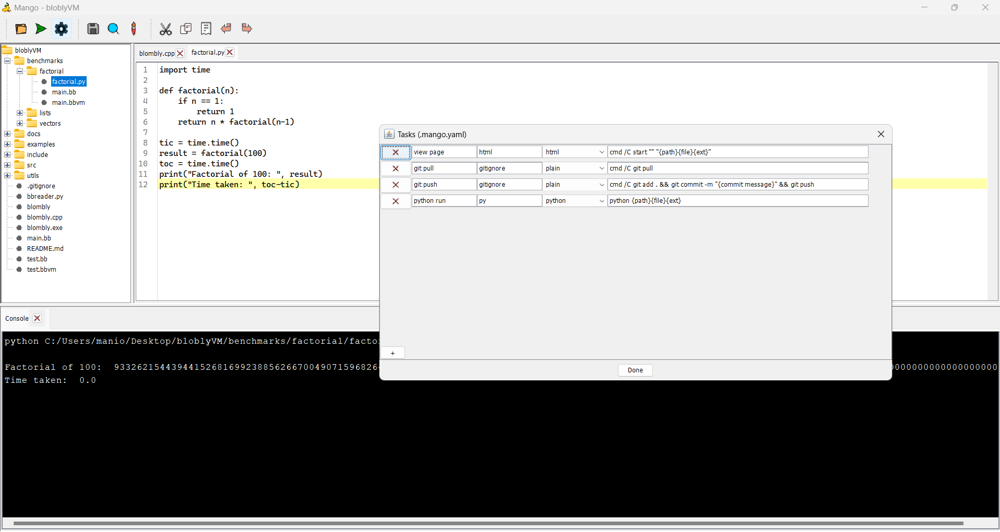

# Mango

A tasty code editor; simple, lightweight, and runnable.

### About

There are a lot of tools for code writing, and Mango here 
is what I would like the experience to feel like:
common useful features at a fraction of the 
complexity. As simple as eating a fruit! 
🥭 Even first-time users can jump straight into coding 
and running things.

Mango is kept simple by providing a small set of vital operations 
that do not need menus organize. Most UI buttons are mapped to well-known 
shortcuts; hover over them for a refresher.

### Run configurations

Tasks (e.g., compilation) can be associated with certain file types.
Configurations are read from a `.mango.yaml` file in the opened top directory.
For easy of use, Mango offers an organized dialog to edit this file (click on the :gear: 
button, but you can also try to open it if it's there). 
The configuration contains several named tasks, each with a list of
associated file extensions, a code highlighter 
(lesser known languages can borrow highlighters from established ones),
and a command to run. Multiple commands for the same file appear as options
to choose from. For instance, in the screenshot above, running the project's
.gitignore will create a dialog to choose between pushing and pulling.

Use bracketed substrings to customize running commands.
First, for the currently open file, the expression `{path}{file}{ext}` corresponds 
to its full absolute path.
For example, the `{file}` part when running `c:\users\maniospas\test.py` is replaced by 
`test` without the quotations. 
Other bracketed strings are replaced by a message the the user is asked to fill. For
example, in the screenshot above, the push task includes a new message each time.

**Planned:** Common defaults for working with different types of projects will
become available in the future.

### Acknowledgements

A big shout out to a couple of project that Mango depends on. These provide robust 
and highly polished solutions:

- [RSyntaxTextArea](https://bobbylight.github.io/RSyntaxTextArea/) is a syntax highlighter
- [FlatLaf](https://www.formdev.com/flatlaf) offers many themes beyond Java's conventional ones

### Contributing

Feel free to point out bugs or make feature requests in this repository's issue page.

